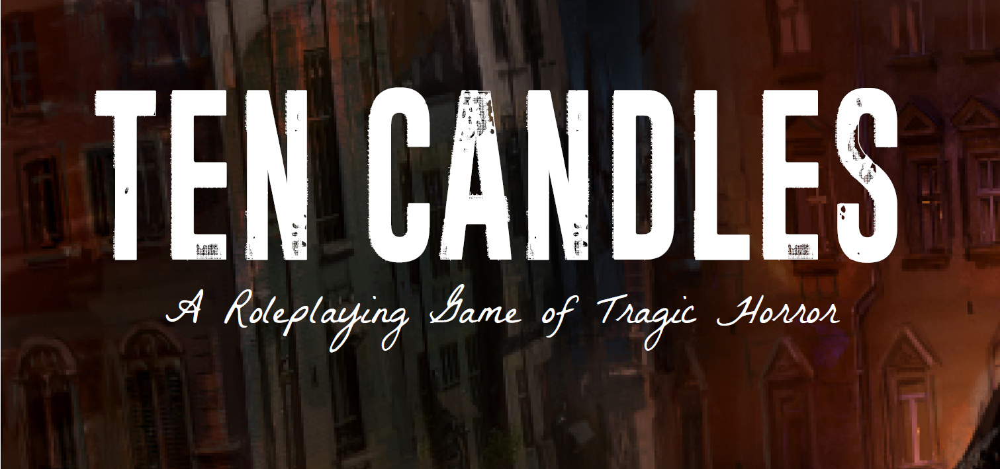

# Ten Candles — Unofficial Foundry VTT Game System

**English** · [Italiano](README.it.md)




An **unofficial, fan-made** game system that brings *Ten Candles* — the tragic horror storytelling game by **Cavalry Games** — to Foundry Virtual Tabletop. It recreates the ten dwindling candles, the shrinking dice pool, and the collaborative descent into the dark, wrapped in a candlelit table scene.

> ⚠️ **Legal / disclaimer.** This project contains **only the game's mechanics** — **no rulebook text is included**. You must own a legally purchased copy of *Ten Candles* to play. All narrative content (scenarios, "modules", truths) is provided by your group. *Ten Candles* and its trademarks belong to Cavalry Games; this project is not affiliated with or endorsed by them.

---

## ✨ Features

**Mechanics**
- Ten shared candles as a dwindling resource, with automatic scene changes and refills.
- Player dice pool (= lit candles) and GM dice pool (= 10 − lit), synced across all clients.
- Interactive **conflict rolls** in chat: success on 6, Hope die on 5–6, loss of 1s, narration rights.
- **Traits** (Virtue / Vice), **Moment** (→ Hope die) and **Brink** (embrace to reroll the pool).
- **The Last Stand** and end-of-game handling, plus the ritual "These things are true…" prompts.

**The table**
- A **top-down seance board**, generated by geometry: a round wooden table with a rectangular **ouija board**, ten candles in a ring (smoke + warm pools of light), and a **ritual circle** that intensifies as candles dwindle.
- **Player webcams** in a circle around the table (2–6, adaptive); a central **planchette** holds the master's ("spirit") webcam and **slides** toward a letter when the master acts.
- **The Last Stand** turns the board blood-red. Fully vector (SVG), scales crisply, and respects `prefers-reduced-motion`.

**Rituals & finale**
- **Collaborative character creation**: a guided flow where neighbors write each other's Virtue, Vice, and Brink, plus a **"Them"** step for the antagonist.
- **Interactive Truths** between scenes, collected and synced across the table.
- **Final recordings**: upload a clean audio file; Foundry plays it with a real-time **old tape-recorder** effect.
- **Italian & English** localization.

---

## 📦 Requirements

- **Foundry VTT v13** (verified). Runs on **v14** (shown as unverified but enabled).
- No dependencies. **Dice So Nice!** is supported but optional.
- For webcam slots: enable Foundry's **Audio/Video** system.

## 🚀 Installation

**Via Manifest URL (recommended)** — in Foundry: *Game Systems → Install System*, then paste:

```
https://github.com/incesupertramp/ten-candles/releases/latest/download/system.json
```

**Manual** — download the latest `ten-candles.zip` from [Releases](https://github.com/incesupertramp/ten-candles/releases), extract it into your Foundry `Data/systems/` folder (so that `Data/systems/ten-candles/system.json` exists), and restart Foundry.

## ▶️ Quick start

1. Create a world using the **Ten Candles** system.
2. Create **character** actors and fill in Concept, Virtue, Vice, Moment and Brink.
3. Open the **board** — the flame button in the toolbar, or `game.system.api.openBoard()`.
4. As GM, press **New game** to light the ten candles, then play: roll conflicts from a character sheet, and darken candles as the dark closes in.

## 📚 Documentation

- **English** — [User manual](MANUAL.en.md) · [Changelog](CHANGELOG.en.md) · [Roadmap / ToDo](TODO.en.md)
- **Italiano** — [Manuale d'uso](MANUALE.md) · [Changelog](CHANGELOG.md) · [ToDo](TODO.md)

## 🖼️ Screenshots

<!-- Add your screenshots here, e.g.:  -->
*Coming soon.*

---

## 🗺️ Roadmap

Planned mechanics and features are tracked in **[TODO.md](TODO.md)** — including the collaborative character-creation card passing, interactive Truths, dire conflicts and martyrdom, final recordings, and localization. Changes per release are in **[CHANGELOG.md](CHANGELOG.md)**.

## 🤝 Contributing

Issues and pull requests are welcome. Please keep contributions focused on **mechanics and interface** only — never include text or artwork from the *Ten Candles* rulebook.

## 📄 License

The **code** in this repository is released under the **MIT License** (see `LICENSE`). This license covers the code only and does **not** extend to *Ten Candles*, which remains the intellectual property of Cavalry Games.

## 🙏 Credits

- *Ten Candles* © **Cavalry Games**.
- System development: **incesupertramp**.
